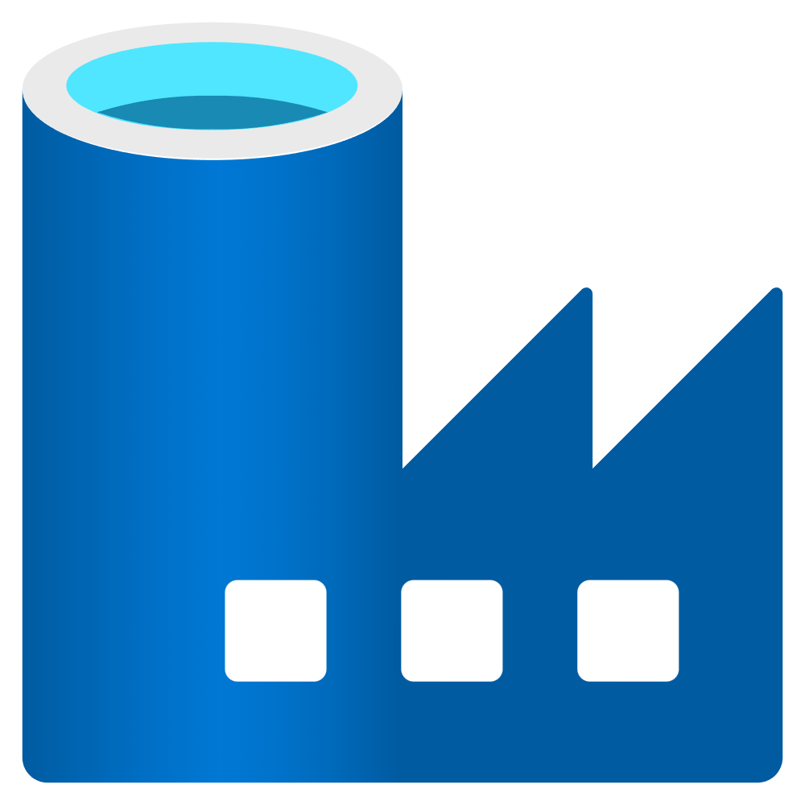

<a id="readme-top"></a>

<!-- PROJECT LOGO -->
<br />
<div align="center">
  <a href="https://github.com/lucas-sva/contoso-stock">
    
  </a>

<h3 align="center">Contoso Stock</h3>

  <p align="center">
    Sistema de Alocação Otimizada para Logística B2B com DDD e CQRS
    <br />
    <a href="https://github.com/lucas-sva/contoso-stock/wiki"><strong>Explore a Wiki »</strong></a>
    <br />
    <br />
  </p>
</div>

<!-- ABOUT THE PROJECT -->
## Sobre o projeto

A **Contoso Stock** é uma plataforma de logística focada em resolver o desafio de *fulfillment* em cadeias de suprimentos complexas.

Além de resolver o problema de negócio (alocação de estoque), este projeto serve como um **laboratório avançado de Engenharia de Software**, demonstrando a implementação prática de padrões táticos e estratégicos de Domain-Driven Design (DDD) em .NET moderno.

### Por que este projeto existe?
 O projeto **Contoso Stock** (um sistema de logística B2B) é desenvolvido em paralelo ao estudo aprofundado do livro:
**Learning Domain-Driven Design**, de Vladik Khononov.  

### Arquitetura e Design Técnico
O sistema segue uma **Clean Architecture** estrita, utilizando **CQRS Híbrido** para balancear segurança e performance:

* **Domain-Driven Design:** O coração do software é isolado, rico em comportamentos e livre de dependências externas.


* **CQRS:**
  * **Write Stack (Comandos):** Utiliza **EF Core** e **Repositories** para garantir consistência transacional e validação de invariantes de negócio.
  * **Read Stack (Consultas):** Utiliza **Dapper** e **SQL Puro** (PostgreSQL) para leituras de alta performance, projetando DTOs diretamente para a API.


* **Testes Automatizados:** Cobertura de Testes Unitários (regras de domínio) e Testes de Integração (fluxo completo API -> Banco).

### Estrutura da Solução

```plaintext
📂 src
├── 📂 ContosoStock.Api                  # Entry Point (REST API, Controllers, Swagger/Scalar)
├── 📂 ContosoStock.Application          # Casos de Uso (Handlers, Commands, Queries, DTOs)
├── 📂 ContosoStock.Domain               # O Core (Aggregates, Value Objects, Domain Services)
└── 📂 ContosoStock.Infrastructure       # O Mundo Externo (EF Core, Dapper, Postgres, ACLs)

📂 tests
├── 📂 ContosoStock.Api.Tests            # Testes de Integração (WebApplicationFactory + Docker)
├── 📂 ContosoStock.Domain.Tests         # Testes Unitários (xUnit + NSubstitute)
└── 📂 ContosoStock.Infrastructure.Tests # Testes de persistência

```

### Built With

* [![.NET][dotnet-shield]][dotnet-url]
* [![Docker][docker-shield]][docker-url]
* [![PostgreSQL][postgresql-shield]][postgresql-url]
* [![Dev Container][devcontainer-shield]][devcontainer-url]
* [![GitHub Actions][gha-shield]][gha-url]

<br />

<!-- GETTING STARTED -->
## Como começar

Para rodar o projeto localmente e contribuir, siga os passos abaixo. Recomendamos o uso de **Dev Containers** para garantir um ambiente idêntico ao de produção.

### Pré-requisitos

* **Docker Desktop**
* **VS Code** com a extensão **Dev Containers** instalada.

### Instalação

1. Clone o repositório:
   ```sh
   git clone https://github.com/lucas-sva/contoso-stock.git
    ```
<spam></spam>

2. Abra a pasta no VS Code.

<spam></spam>

3. Quando solicitado, clique em **"Reopen in Container"**.
   * *O Docker irá subir automaticamente dois containers: um para o .NET e outro para o PostgreSQL.*

<spam></spam>

4. O ambiente será configurado automaticamente com o .NET 10 SDK.

<spam></spam>

5. Compile o projeto:
    ```sh
    dotnet build
    ```

<spam></spam>

6. Rode a aplicação:
    ```sh
    dotnet run --project src/ContosoStock.Api
    ```
<spam></spam>

7. Acesse a documentação da API (Scalar/OpenAPI) em: `http://localhost:5000/scalar/v1`

<br />

<!-- ROADMAP -->
## Roadmap

O projeto será evoluído em ciclos, seguindo os capítulos da obra de Vladik Khononov:

- [x] **Parte I: Design Estratégico**
    - [x] Cap 1: Analisando Domínios de Negócio (Strategic Mapping)
    - [x] Cap 2: Descobrindo Conhecimento de Domínio (Ubiquitous Language)
    - [x] Cap 3: Gerenciando a Complexidade (Bounded Contexts)
    - [x] Cap 4: Context Mapping
  
<span></spam>

- [x] **Parte II: Design Tático**
    - [x] Cap 5: Implementando a Lógica de Negócio (Business Logic Implementation)
    - [x] Cap 6: Combatendo a Complexidade (Value Objects & Entities)
    - [x] Cap 7: Modelando Consistência (Aggregates)
    - [x] Cap 8: Modelando o Tempo (Domain Events)

<span></spam>

- [x] **Parte III: Design Arquitetural**
  - [x] Cap 9: Comunicação com a Persistência (Repositories)
  - [x] Cap 10: Organizando a Lógica de Aplicação (Application Service)
  - [x] Cap 11: Evoluindo para CQRS (Command Query Responsibility Segregation)

<span></spam>

- [ ] **Parte IV: Contexto e Dados**
    - [ ] Cap 12: Event Sourcing
    - [ ] Cap 13: Data Mesh & Microservices
  
Veja as [issues](https://github.com/lucas-sva/contoso-stock/issues) para uma lista completa de funcionalidades propostas.

<br />

<!-- CONTACT -->
## Contato

Lucas Silva - [LinkedIn](https://www.linkedin.com/in/-lucassva/) - lucas.sva@outlook.com


<p align="right">(<a href="#readme-top">voltar ao topo</a>)</p>


<!-- MARKDOWN LINKS & IMAGES -->
<!-- https://www.markdownguide.org/basic-syntax/#reference-style-links -->
[docker-shield]: https://img.shields.io/badge/Docker-2496ED?style=for-the-badge&logo=docker&logoColor=white
[postgresql-shield]: https://img.shields.io/badge/PostgreSQL-3266CC?style=for-the-badge&logo=postgresql&logoColor=white
[linkedin-url]: https://linkedin.com/in/linkedin_username
[product-screenshot]: images/screenshot.png
[dotnet-shield]: https://img.shields.io/badge/.NET-512BD4?style=for-the-badge&logo=dotnet&logoColor=white
[gha-shield]: https://img.shields.io/badge/GitHub%20Actions-2088FF?style=for-the-badge&logo=githubactions&logoColor=white
[devcontainer-shield]: https://img.shields.io/badge/Dev%20Container-2A7BDE?style=for-the-badge&logo=visualstudiocode&logoColor=white
[csharp-shield]: https://img.shields.io/badge/C%23-239120?style=for-the-badge&logo=csharp&logoColor=white

<!-- Shields.io badges. You can a comprehensive list with many more badges at: https://github.com/inttter/md-badges -->
[docker-url]: https://www.docker.com/
[postgresql-url]: https://www.postgresql.org/
[dotnet-url]: https://dotnet.microsoft.com/
[gha-url]: https://github.com/features/actions
[devcontainer-url]: https://code.visualstudio.com/docs/devcontainers/containers
[csharp-url]: https://learn.microsoft.com/dotnet/csharp/
